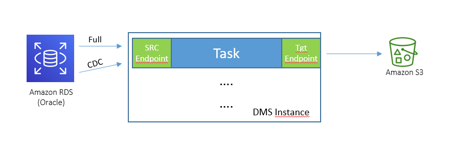

# Step 1 - Basic service setup

## Create a new VPC - use default one

The VPC architecture will be:  
  

### Create VPC Endpoints  
Create VPC Endpoint for S3: https://eu-west-1.console.aws.amazon.com/vpc/home?region=eu-west-1#Endpoints:sort=vpcEndpointId  

## Creazione di un Bucket S3
https://s3.console.aws.amazon.com/s3/home?region=eu-west-1#


## Create an Oracle RDS Instance on VPC

### Create a Security Group for Rds  
https://eu-west-1.console.aws.amazon.com/ec2/v2/home?region=eu-west-1#SecurityGroups:  

### Create RDS Instance  
Create instance: https://eu-west-1.console.aws.amazon.com/rds/home?region=eu-west-1  
with following configuration:  
- Create an Oracle RDS Standard Edition 2 
    - Instance name: orcl
    - instance type: db.m5.large
    - 50 GB
    - on selected VPC 
    - Assigning previously created Security Group

## Create Workspece environment

### Crea un SimpleAD on selected VPC (about 10 min).  
https://eu-west-1.console.aws.amazon.com/directoryservicev2/home?region=eu-west-1#!/directories  

### Create a Workspace environment
Create a new Workspace Environment (Power to speed-up SW set-up phase): https://eu-west-1.console.aws.amazon.com/workspaces/home?region=eu-west-1#listworkspaces:  

Once workspace environment is ready:
- Enable access via WEB
- download and install:
    - https://eng-import-oracle.s3.amazonaws.com/OracleSW/winx64_12102_SE2_database_1of2.zip
    - https://eng-import-oracle.s3.amazonaws.com/OracleSW/winx64_12102_SE2_database_2of2.zip
    - https://eng-import-oracle.s3.amazonaws.com/OracleSW/sqldeveloper-18.4.0-376.1900-x64.zip
    - Install winRar
- download data locally:
    - https://fede-hpc-workshop-wrf.s3.us-east-2.amazonaws.com/archive/clienti.tar.gz
    - https://fede-hpc-workshop-wrf.s3.us-east-2.amazonaws.com/archive/consensi.tar.gz
    - https://fede-hpc-workshop-wrf.s3.us-east-2.amazonaws.com/archive/contratti.tar.gz
    - https://fede-hpc-workshop-wrf.s3.us-east-2.amazonaws.com/archive/credito.tar.gz
    - https://fede-hpc-workshop-wrf.s3.us-east-2.amazonaws.com/archive/prodotti.tar.gz
    - https://fede-hpc-workshop-wrf.s3.us-east-2.amazonaws.com/archive/punti_di_fornitura.tar.gz  
    and uncompress 

### Configure workspace security group in order to access RDS.  
Identify workspace ENI and its securty group: https://eu-west-1.console.aws.amazon.com/ec2/v2/home?region=eu-west-1#NIC:sort=networkInterfaceId  
Configure RDS Security Group in order to accept connections from workspaces: https://eu-west-1.console.aws.amazon.com/ec2/v2/home?region=eu-west-1#SecurityGroups:  

### Log into Workspace, create oracle database schema and import data  
#### Configure tnsnames.ora
```bash
ORCL=
	 (DESCRIPTION=
		(ADDRESS_LIST=
		      (ADDRESS=
			(PROTOCOL=tcp)
			(HOST=<RDS.ENDPOINT>)
			(PORT=1521)
	      		)
                )
	        (CONNECT_DATA=
			(SID=orcl)
		)
	)
```
#### Create tables:
```bash
sqlplus user/pwd@orcl create_tables.sql
```
#### Load Tables data via sqlldr

```bash
sqlldr user/pwd@orcl control=clienti.ctl log=clienti.log bad=clienti_bad.csv
sqlldr user/pwd@orcl control=contratti.ctl log=contratti.log bad=contratti_bad.csv
sqlldr user/pwd@orcl control=credito.ctl log=credito.log bad=credito_bad.csv
sqlldr user/pwd@orcl control=prodotti.ctl log=prodotti.log bad=prodotti_bad.csv
sqlldr user/pwd@orcl control=punti_di_fornitura.ctl log=punti_di_fornitura.log bad=punti_di_fornitura.csv

```  

#### Rebuild unusable indexes  
Set up SQL Developer connection string to RDS:
```bash
Hostname: <RDS.ENDPOINT>  
Port: 1521  
SID: orcl  
```  

Connect to the database and get the list of UNUSABLE indexes using
```bash
select 'alter index '||index_name||' rebuild' from user_indexes where status='UNUSABLE'
```  
execute statements generated by former query to rebuild indexes.


### Create a DMS instance on VPC: (10 min)
  

#### Set-up Source Endpoint per RDS:  
Endpoint specific settings:   
```bash
useLogminerReader=N;useBfile=Y;accessAlternateDirectly=false;useAlternateFolderForOnline=true;oraclePathPrefix=/rdsdbdata/db/ORCL_A/;usePathPrefix=/rdsdbdata/log/;replacePathPrefix=true  
```  

Creazione del Service Access Role per scrivere nel bucket S3  
Creazione del target endpoint su S3:  
	    - Endpoint specific settings:   
	
```bash
addColumnName=true;compressionType=NONE;csvDelimiter=,;csvRowDelimiter=\n;includeOpForFullLoad=true; 
```

```bash
compressionType=NONE;datePartitionEnabled=false;timestampColumnName=DMS_TIMESTAMP;dataFormat=parquet;
```


