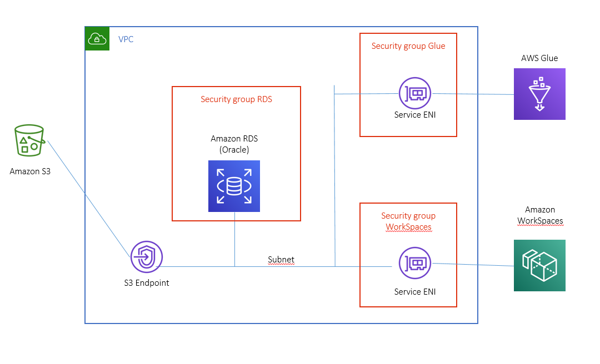

# Step 1 - Basic service setup

## Create a new VPC - use default one

The VPC architecture will be:  
  

### Create VPC Endpoints  
Create VPC Endpoint for S3: https://eu-west-1.console.aws.amazon.com/vpc/home?region=eu-west-1#Endpoints:sort=vpcEndpointId  

## Create an S3 Bucket
https://s3.console.aws.amazon.com/s3/home?region=eu-west-1#


## Create an Oracle RDS Instance on VPC (13 USD/day)

### Create a Security Group for Rds  
https://eu-west-1.console.aws.amazon.com/ec2/v2/home?region=eu-west-1#SecurityGroups:  

### Create RDS Instance  
Create instance: https://eu-west-1.console.aws.amazon.com/rds/home?region=eu-west-1  
with following configuration:  
- Create an Oracle RDS Standard Edition 2 
    - Instance name: orcl
    - instance type: db.m5.large
    - 50 GB
    - on selected VPC 
    - Assigning previously created Security Group

## Create Workspece environment

### Create a SimpleAD on selected VPC (about 10 min).  
https://eu-west-1.console.aws.amazon.com/directoryservicev2/home?region=eu-west-1#!/directories  

### Create a Workspace environment (11,00 USD/month + 0,74 USD/hour)
Create a new Workspace Environment (Power to speed-up SW set-up phase): https://eu-west-1.console.aws.amazon.com/workspaces/home?region=eu-west-1#listworkspaces:  

Once workspace environment is ready:
- Enable access via WEB
- download and install:
    - Oracle tools including SQLPLUS and SQLLDR
    - Oracle SQL Developer
    - WinRar
    - AWS Cli: https://docs.aws.amazon.com/cli/latest/userguide/install-cliv2-windows.html
- download data locally:
    - https://fede-hpc-workshop-wrf.s3.us-east-2.amazonaws.com/archive/clienti.tar.gz
    - https://fede-hpc-workshop-wrf.s3.us-east-2.amazonaws.com/archive/consensi.tar.gz
    - https://fede-hpc-workshop-wrf.s3.us-east-2.amazonaws.com/archive/contratti.tar.gz
    - https://fede-hpc-workshop-wrf.s3.us-east-2.amazonaws.com/archive/credito.tar.gz
    - https://fede-hpc-workshop-wrf.s3.us-east-2.amazonaws.com/archive/prodotti.tar.gz
    - https://fede-hpc-workshop-wrf.s3.us-east-2.amazonaws.com/archive/punti_di_fornitura.tar.gz  
    and uncompress 

### Configure workspace security group in order to access RDS.  
Identify workspace ENI and its securty group: https://eu-west-1.console.aws.amazon.com/ec2/v2/home?region=eu-west-1#NIC:sort=networkInterfaceId  
Configure RDS Security Group in order to accept connections from workspaces: https://eu-west-1.console.aws.amazon.com/ec2/v2/home?region=eu-west-1#SecurityGroups:  

### Log into Workspace, create oracle database schema and import data  
#### Configure tnsnames.ora
```bash
ORCL=
	 (DESCRIPTION=
		(ADDRESS_LIST=
		      (ADDRESS=
			(PROTOCOL=tcp)
			(HOST=<RDS.ENDPOINT>)
			(PORT=1521)
	      		)
                )
	        (CONNECT_DATA=
			(SID=orcl)
		)
	)
```
#### Create tables:
```bash
sqlplus user/pwd@orcl create_tables.sql
```
#### Load Tables data via sqlldr

```bash
sqlldr user/pwd@orcl control=clienti.ctl log=clienti.log bad=clienti_bad.csv
sqlldr user/pwd@orcl control=contratti.ctl log=contratti.log bad=contratti_bad.csv
sqlldr user/pwd@orcl control=credito.ctl log=credito.log bad=credito_bad.csv
sqlldr user/pwd@orcl control=prodotti.ctl log=prodotti.log bad=prodotti_bad.csv
sqlldr user/pwd@orcl control=punti_di_fornitura.ctl log=punti_di_fornitura.log bad=punti_di_fornitura.csv

```  

#### Rebuild unusable indexes  
Set up SQL Developer connection string to RDS:
```bash
Hostname: <RDS.ENDPOINT>  
Port: 1521  
SID: orcl  
```  

Connect to the database and get the list of UNUSABLE indexes using
```bash
select 'alter index '||index_name||' rebuild' from user_indexes where status='UNUSABLE'
```  
execute statements generated by former query to rebuild indexes.

#### Enable Oracle extended logging in order to support CDC  
Use SQL Developer and execute the following statements
```bash
-- Enable Supplemental logging
exec rdsadmin.rdsadmin_util.alter_supplemental_logging('ADD');
exec rdsadmin.rdsadmin_util.alter_supplemental_logging('ADD','ALL');
exec rdsadmin.rdsadmin_util.alter_supplemental_logging('DROP','PRIMARY KEY');

-- Create directories to store arcive logs and online logs
exec rdsadmin.rdsadmin_master_util.create_archivelog_dir;
exec rdsadmin.rdsadmin_master_util.create_onlinelog_dir;

-- Keep logs online for 24 hours
exec rdsadmin.rdsadmin_util.set_configuration ('archivelog retention hours',24);

-- Check Directory names
SELECT directory_name, directory_path FROM all_directories;


--GRANT READ ON DIRECTORY ARCHIVELOG_DIR TO admin;
--GRANT READ ON DIRECTORY ONLINELOG_DIR TO admin;

-- select * from v$logfile;

-- select * from v$archived_log;
```  


### Create a DMS instance on VPC: (10 min) (4.39 USD/day)
  

#### Create Replication Instance  
https://eu-west-1.console.aws.amazon.com/dms/v2/home?region=eu-west-1#replicationInstances  
with the following configuration:
```bash
Instance type: dms.t2.medium
Storage:  150 Gb
Security Group: previously created SG
```  
#### Set-up Source Endpoint for RDS:  
Create a source endpoint for RDS: https://eu-west-1.console.aws.amazon.com/dms/v2/home?region=eu-west-1#endpointList  
with the following parameters:  
```bash
endpoint identifier: orcl
Select RDS Instance: orcl
Endpoint specific settings: useLogminerReader=N;useBfile=Y;accessAlternateDirectly=false;useAlternateFolderForOnline=true;oraclePathPrefix=/rdsdbdata/db/ORCL_A/;usePathPrefix=/rdsdbdata/log/;replacePathPrefix=true  
```  

#### Set-up Target Endpoint for S3: 
Create a DMS service access role to grant access to our S3 bucket: 

Create a policy to grant access to s3 bucket: https://console.aws.amazon.com/iam/home?region=eu-west-1#/policies  
```bash
{
    "Version": "2012-10-17",
    "Statement": [
        {
            "Effect": "Allow",
            "Action": [
                "s3:PutObject",
                "s3:DeleteObject",
                "s3:PutObjectTagging"
            ],
            "Resource": "arn:aws:s3:::<bucket-name>/*"
        },
        {
            "Effect": "Allow",
            "Action": [
                "s3:ListBucket"
            ],
            "Resource": "arn:aws:s3:::<bucket-name>"
        }
    ]
}
```  
Create a reole to allow DMS to access previusly created policy: https://console.aws.amazon.com/iam/home?region=eu-west-1#/roles  
assigning previously created policy

Then create a target endpoint for S3: https://eu-west-1.console.aws.amazon.com/dms/v2/home?region=eu-west-1#endpointList  
with the following settings:  

```bash
Target engine: S3
Bucket Name: <bucket_name>
Buckst Folder: cdc_oracle
Service Access Role: <previously created Access Role>
Endpoint specific settings:  addColumnName=true;compressionType=NONE;csvDelimiter=,;csvRowDelimiter=\n;includeOpForFullLoad=true; 
```

Additional options to generate parquet output instead of csv
```bash
compressionType=NONE;datePartitionEnabled=false;timestampColumnName=DMS_TIMESTAMP;dataFormat=parquet;
```

#### Create a Database Migration Task  
https://eu-west-1.console.aws.amazon.com/dms/v2/home?region=eu-west-1#CreateNewTask  

```bash
Replication Instance: previously created
Source database endpoint: orcl
Target database endpoint: s3
Migration type: migrate existing data and replicate ongoing changes
CDC stop mode: don't use custom CDC stop mode
Tabel Preparation mode: do nothing
Stop task afted full load completes: don't stop
Include lob columns in replication: Limit lob mode
Maximum Lob size: 32 KB
Table mappings:
    Schemaname: ADMIN
    
```    
    
