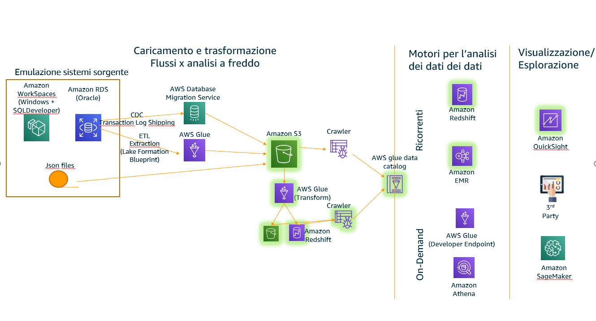

# Step 3 - 


## Overview  
The components we are goint to explore in this session are:  
  


## Load Json Files
### Convert json file from index to record formats
Create a glue job of python type 
```bash
import sys

import boto3
import pandas as pd


bucketname = "fede-analytics-694275606777"
s3 = boto3.resource('s3')
my_bucket = s3.Bucket(bucketname)
source = "datalake/consensi"
target="datalake/consensi_json"

for obj in my_bucket.objects.filter(Prefix=source):
    source_filename = (obj.key).split('/')[-1]
    body = obj.get()['Body'].read()
    dataframe=pd.read_json(body,orient='index').reset_index()
    result=dataframe.to_json(orient="records")
    output=s3.Object(bucketname, '{}/{}'.format(target,source_filename))
    output.put(Body=result)
    
```      

### Configure Glue Crawler to parse Json Files


## Configure redshift

Crate a custom role for redshift with following inline policy to allow access to datalake
RoleName: 

{
    "Version": "2012-10-17",
    "Statement": [
        {
            "Effect": "Allow",
            "Action": [
                "lakeformation:GetDataAccess",
                "glue:GetTable",
                "glue:GetTables",
                "glue:SearchTables",
                "glue:GetDatabase",
                "glue:GetDatabases",
                "glue:GetPartitions"
            ],
            "Resource": "*"
        }
    ]
}

Crate a redshift cluster:

```bash
create external schema if not exists datalake from DATA CATALOG database 'datalake' iam_role 'arn:aws:iam::<account-id>:role/<role-name>' region '<region>';
```  

Test some queries
```bash
select count(*) from datalake.customer_view_churn_analisys;

create table  local_customer_view_churn_analisys as select * from datalake.customer_view_churn_analisys;

select count(*) from local_customer_view_churn_analisys a , datalake.customer_view_churn_analisys b 
where
a.key_soggetti=b.key_soggetti;

## Accessing data using Quicksight leveraging Athena
Enable Quicksight Enterprise (so we can also access Oracle database directly)

Enable Athena in security panel
Enable access to S3 buckets (data and where athena saves the queries)
Grant access to database and tables to IAMAllowedPrincipals role.

