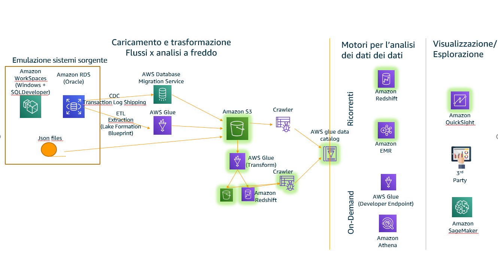

# Step 3 - Churn Model.  

## Overview  
The components we are goint to explore in this session are:  
  

## Adjust sagemaker role  
We would like to leverage Athena to extract data from datalake to perform the analysis, we need to authorize Sagemaker to Run Athena queryes.  
https://console.aws.amazon.com/iam/home?region=eu-west-1#/roles  

attach policy AdministratorAccess for demo purpose. 

## Connect to Sagemaker Notebook  
Download from github MLChurnPrediction.ipynb and follow istructions contained in the notebook. 

