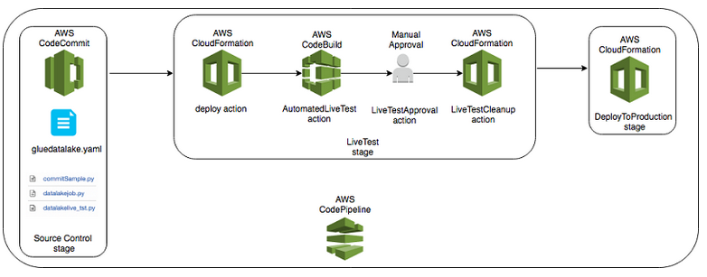

# Step 3 - CI/CD Example for Glue Jobs


## Overview  
The components we are goint to explore in this session are:  
  


Download this repo to a Sagemaker notebook used to work with Glue Developer Endpoint.  

## Deploy cloudformation template to set-up CI/CD pipeline (10 - 15 minutes)
Upload cloud formation template to an s3 bucket:  
```bash  
cd $HOME/Sagemaker
git clone https://github.com/usumfabricae/data-analytics-poc.git
cd data-analytics-poc/
aws s3 cp ./ci-cd/gluePipeline.yaml s3://<target-bucket>/cloudformation/
```  

Open Cloudformation console:  
https://eu-west-1.console.aws.amazon.com/cloudformation/home?region=eu-west-1#/stacks?filteringText=&filteringStatus=active&viewNested=true&hideStacks=false  
Select Creat stack (with new resources), provide http path to previously saved template.  
Leave all other options as they are, acknowledge that the template will create new IAM Roles.  

This template will create:
- a CodeCommit Repository to store the source code  
- a CodePipeline to orchestrate build, test and deployment  
- an automated infrastructure component deployment for testing  
- a CodeBuild step used to test the deployment  
- an automated testing infrastructure clean-up after deployment  
- A manual approval for testing results  
- Automated transition into production  


## Adjust Lakeformation permission to allow deployment of new items using CodePipeline  
Go to: https://eu-west-1.console.aws.amazon.com/lakeformation/home?region=eu-west-1#catalog-settings  
Add among datalake administrators cicd role (the mame of the role is gluedemocicd-CloudFromationRole-XXXX)


## Using CodeCommit code repository from Sagemaker  

### Update sagemaker permission to access to AWS CodeCommit
In IAM select role AWSGlueServiceSageMakerNotebookRole*  
add the following plicy: AWSCodeCommitPowerUser  


### From Sagemaker Notebook connect to AWS CodeCommit Repository  


Set-up git credential helper

```bash  
git config --global credential.helper '!aws codecommit credential-helper $@'
git config --global credential.UseHttpPath true
```  

### Read repository URL from AWS CodeCommit page  
Open: https://eu-west-1.console.aws.amazon.com/codesuite/codecommit/repositories?region=eu-west-1  
Click on HTTPS link related to your repository  

Go back to Sagemaker Notebook and

```bash  
cd $HOME/Sagemaker
git clone https://git-codecommit.eu-west-1.amazonaws.com/v1/repos/gluedemocicd
cd gluedemocicd
```  

Now we can copy scripts add demo scripts into this repository:
```bash  
cp ../data-analytics-poc/ci-cd/codecommit/* .
git add gluedatalake.yaml
git add datalakejob.py
git add datalakelive_tst.py
git add commitSample.py
git commit
```  


Modify ETL Job Query
Issue a git commit and push changes to code commit

```bash  
git add datalakejob.py
git commit
git push
```  

CI/CD process can be monitored accessing to AWS CodePipeline:  
https://eu-west-1.console.aws.amazon.com/codesuite/codepipeline/pipelines?region=eu-west-1  

### Allow new environments to access to datalake tables used in read for testing:
```bash 
aws lakeformation grant-permissions --principal DataLakePrincipalIdentifier=arn:aws:iam::694275606777:role/gluedemocicdtest-gluerole-S350UICTINT3 --permissions "SELECT" "INSERT" "DESCRIBE" --resource '{ "Table": {"DatabaseName":"datalake", "Name":"l_orcl_admin_prodotti"}}'
aws lakeformation grant-permissions --principal DataLakePrincipalIdentifier=arn:aws:iam::694275606777:role/gluedemocicdtest-gluerole-S350UICTINT3 --permissions "SELECT" "INSERT" "DESCRIBE" --resource '{ "Table": {"DatabaseName":"datalake", "Name":"l_orcl_admin_credito"}}'
aws lakeformation grant-permissions --principal DataLakePrincipalIdentifier=arn:aws:iam::694275606777:role/gluedemocicdtest-gluerole-S350UICTINT3 --permissions "SELECT" "INSERT" "DESCRIBE" --resource '{ "Table": {"DatabaseName":"datalake", "Name":"l_orcl_admin_soggetti"}}'
aws lakeformation grant-permissions --principal DataLakePrincipalIdentifier=arn:aws:iam::694275606777:role/gluedemocicdtest-gluerole-S350UICTINT3 --permissions "SELECT" "INSERT" "DESCRIBE" --resource '{ "Table": {"DatabaseName":"datalake", "Name":"l_orcl_admin_punti_di_fornitura"}}'
aws lakeformation grant-permissions --principal DataLakePrincipalIdentifier=arn:aws:iam::694275606777:role/gluedemocicdtest-gluerole-S350UICTINT3 --permissions "SELECT" "INSERT" "DESCRIBE" --resource '{ "Table": {"DatabaseName":"datalake", "Name":"l_orcl_admin_contratti"}}'

```  


